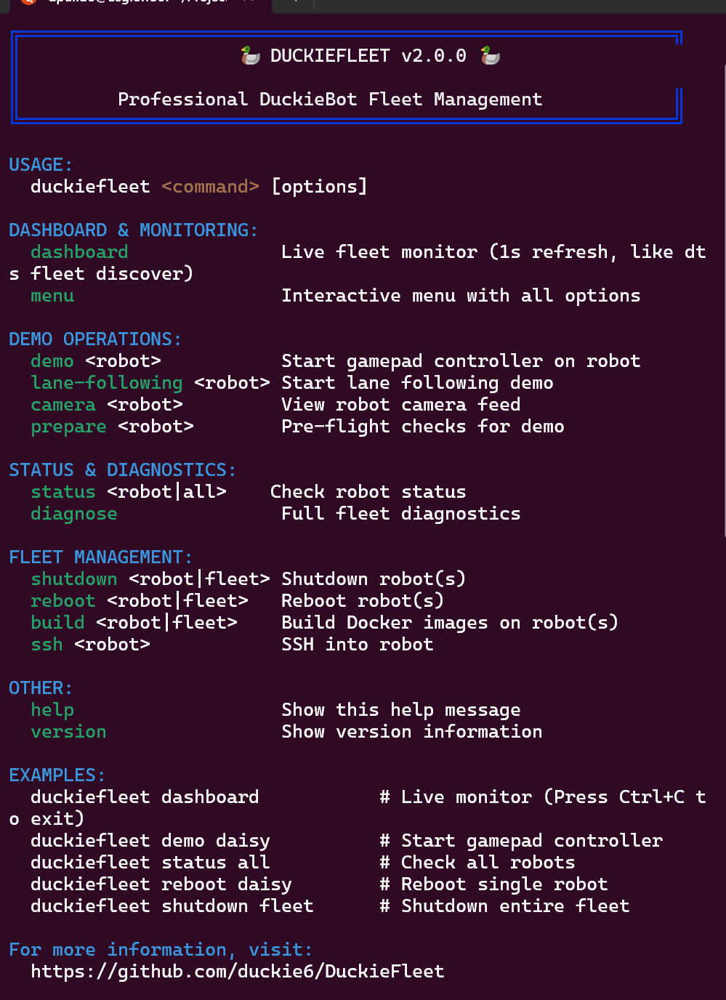
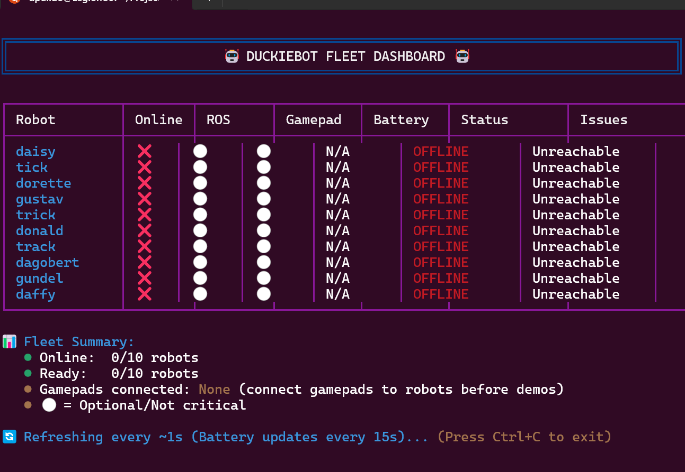

# DuckieFleet Management System (FMS) CLI for Duckiebots at the Institute for Robotics and Autonomous Systems (IRAS) in Germany.

Copyright 2025

### [Public Portfolio Version]

This repository serves as a portfolio showcase for a comprehensive Fleet Management System (FMS) CLI tool I architected and developed during my role at the Institute of Robotics and Autonomous Systems (IRAS, HKA).

*The full, in-development codebase remains private to the institute's organization, but this repository demonstrates the architecture, features, and non-sensitive helper scripts.*

## Objective

To automate the deployment, diagnostics, and management of  fleets of Duckiebots  using a single, powerful command-line interface called Duckiefleet.

## Core Features

* **Fleet Control:** Manage complex start/stop/reboot sequences for entire fleets or individual agents.
* **Automated Diagnostics:** A powerful tool (built in **Python** and **Bash**) that runs health checks on robot hardware, software stacks (**ROS2**, **Duckietown Shell**), and network connectivity.
* **ROS2 Integration:** Seamlessly launches and manages ROS2 nodes across multiple robots for data collection and control.

## Tech Stack
* **Core:** Python, Bash
* **Robotics:** ROS2, Duckietown Shell
* **DevOps:** Docker, SSH, YAML (for fleet configuration)

## FMS in Action

*Below are screenshots of the tool in use:*

**Help Menu Output (`./duckiefleet help`):**

**Live Dashboard Output (`./duckiefleet dashboard`):**

**Diagnostic Command Output (`./duckiefleet diagnose`):**

